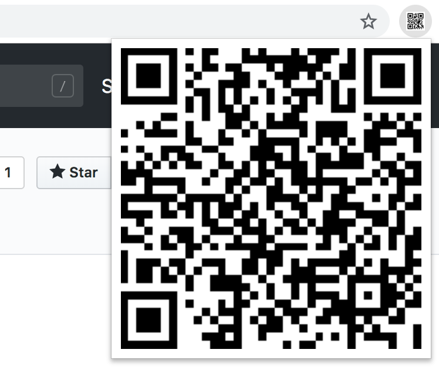

# qr-code

This is a simple browser extension that I wrote to help me share the
currently open tab to my mobile. I frequently run into this situation where
I need to test a website on a physical mobile device. This extension displays
the QR code of the currently open tab and I can just use my phone to scan
and open the URL.

Uses [qrcodejs](https://davidshimjs.github.io/qrcodejs/) to generate QR Codes.

### Usage

* Visit [chrome://extensions/](chrome://extensions/).
* Ensure that the `Developer Mode` toggle is enabled.
* Click on `Load Unpacked`.
* Select the path where this repo was cloned.
* Enjoy!

### LICENSE

MIT © [Sivasubramanyam A](https://siva.dev/)
